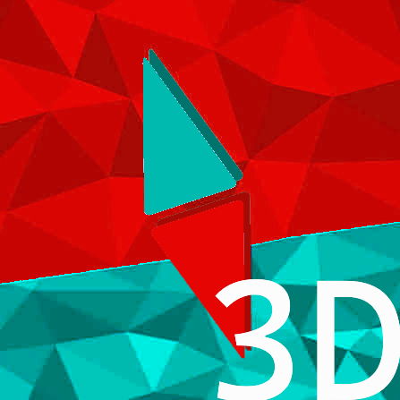

# BlueMap3D

### Trains, airships and turtles on your BlueMap, moving in real time.

## What does this mod do?

[BlueMap](https://modrinth.com/mod/bluemap) renders your world as a 3D map you can open in a
browser. It only draws terrain, so anything that moves is missing.

This adds the moving stuff. Trains, airships, turtles, contraptions. Drawn with their real
blocks and textures, updating as they move.

## Add-ons

BlueMap3D on its own does nothing. Install at least one of these:

| Add-on | Shows | Needs |
| --- | --- | --- |
| **[BlueMap: Create](https://modrinth.com/mod/rxpPQGD1)** | Trains, windmills, bearings, gantries, pistons, minecart contraptions | [Create](https://modrinth.com/mod/create) |
| **[BlueMap: Aeronautics](https://modrinth.com/mod/owyPt6vs)** | Airships, planes, cars | [Sable](https://modrinth.com/mod/sable) |
| **[Bluemap: Computer Craft](https://modrinth.com/mod/uWqMFrYC)** | Turtles, with their labels and tools | [CC:Tweaked](https://modrinth.com/mod/cc-tweaked) |

Trains and airships do not show up on a normal BlueMap at all. Once they are assembled their
blocks are no longer in the world, so there is nothing for the map to render.

## Install

Server side. Players do not need it.

Put BlueMap3D in `mods/` next to [BlueMap](https://modrinth.com/mod/bluemap), add whichever
add-ons you want, restart.

## Settings

`config/bluemap3d-server.toml`. You can ignore all of it.

| Setting | Default | Does |
| --- | --- | --- |
| `publishIntervalTicks` | `10` | How often positions update. Lower is smoother and uses more bandwidth |
| `maxBlocksPerObject` | `20000` | Skips anything bigger than this |
| `hideLiveBlocksFromTiles` | `true` | Stops things being drawn twice |
| `tileReloadMinSeconds` | `-1` | Set to `5` so viewers see mined terrain update without refreshing |
| `useResourcePacks` | `true` | Real models and textures instead of flat colours |
| `sources` | `[]` | Extra resource packs to read models from |
| `shapeFallback` | `true` | Blocks with no model get drawn as their outline shape instead of a cube |
| `maxSpinNodesPerObject` | `32` | How many spinning parts one object can have. Wheels, mainly |

## Questions

**Do players need to install it?**
No. It is server side.

**Does it lag the server?**
Each object is drawn once, then it is only sent a position. A train running all day is
cheap.

**Does it change my existing map?**
No, terrain renders the same as before.

**Versions?**
1.21.1, NeoForge, BlueMap 5.x.

**Nothing is showing up.**
Make sure the mod it needs is installed and the chunks are loaded. Things in unloaded chunks
are not tracked.

## Links

- [BlueMap](https://modrinth.com/mod/bluemap)
- [Bug reports](https://github.com/duzos/bluemap3d/issues)

---

This is a third party mod, not approved by or associated with the developers of BlueMap,
Create, Create: Aeronautics, Sable or CC:Tweaked.

NOT AN OFFICIAL MINECRAFT SERVICE. NOT APPROVED BY OR ASSOCIATED WITH MOJANG OR MICROSOFT.

