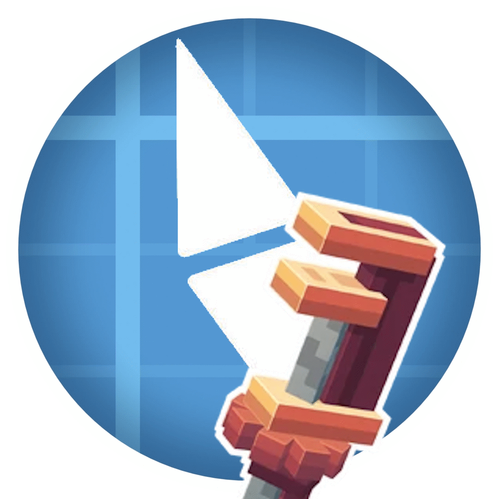

# BlueMap: Create

### Create trains and contraptions on your BlueMap, moving in real time.

## What does this mod do?

Puts your [Create](https://modrinth.com/mod/create) trains on your web map. A normal BlueMap
shows the track and nothing on it, because a contraption blocks leave the world when it
assembles.

Every carriage gets drawn with its real blocks and textures, and moves along the line while
you watch.

Also shows:

- **Minecart contraptions** rolling along the rail
- **Windmills and bearings** turning on their real axis
- **Gantry carriages** sliding along the shaft
- **Pistons and pulleys**, including rope and elevator pulleys

Anything Create moves as a contraption gets moved on the map too.

## Install

Server side. Players do not need it.

Put BlueMap3D, BlueMap: Create and [Create](https://modrinth.com/mod/create) in `mods/`,
next to [BlueMap](https://modrinth.com/mod/bluemap). Nothing to configure.

## Fast windmills look weird

A fast bearing can look like it is spinning slowly backwards, like a wagon wheel in a film.
The map only samples positions twice a second and the sails turn faster than that.

Set `publishIntervalTicks` to `4` in `config/bluemap3d-server.toml` if it bothers you. Costs
a bit of bandwidth. Trains do not need it.

## Questions

**Do trains show when nobody is near?**
Only in loaded chunks. Create keeps simulating the train, but the map cannot see it, so it
disappears and comes back. Chunk loaders along the line sort that.

**Do curved tracks show?**
Not yet. Create draws the curve between two track pieces rather than placing blocks there,
so there is nothing on the map to draw. Straight and diagonal track is fine.

**Chests and display boards on my train look wrong.**
They get drawn as their block shape, without the lid or the text. Contraptions have a lot of
these so it is the most obvious gap.

**Will a big railway lag the server?**
No. A carriage is drawn once and then only sent a position.

**Versions?**
1.21.1, NeoForge, Create 6.

## Links

- [Create](https://modrinth.com/mod/create)
- [BlueMap](https://modrinth.com/mod/bluemap)
- [BlueMap3D](https://modrinth.com/mod/bluemap3d)
- [Bug reports](https://github.com/duzos/bluemap3d/issues)

---

This is a third party mod, not approved by or associated with the developers of Create or
BlueMap.

NOT AN OFFICIAL MINECRAFT SERVICE. NOT APPROVED BY OR ASSOCIATED WITH MOJANG OR MICROSOFT.

