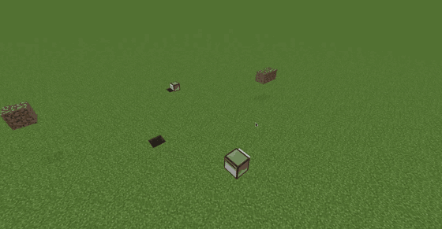
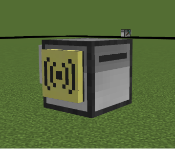
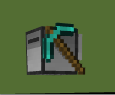

# Bluemap: Computer Craft

### ComputerCraft turtles on your BlueMap, moving in real time.

## What does this mod do?

Puts your [CC:Tweaked](https://modrinth.com/mod/cc-tweaked) turtles on your web map. Every
loaded turtle shows up as its actual model, moving as it moves, with its label on it.

Leave a quarry running and watch the hole appear from the map.

 A fleet wandering a superflat. The dark patches are blocks they mined.

<table>
  <tr>
    <td align="center" valign="top"> <b>Peripherals</b> use CC own models</td>
    <td align="center" valign="top"> <b>Tools</b> are built from their sprite, so they have thickness</td>
  </tr>
</table>

- The real turtle model with its real textures, facing the way it is facing
- **Labels** from `os.setComputerLabel`, on hover
- **Upgrades** show. Modems, speakers and crafting tables use CC own models. Tools are built
  out of the item sprite, so a diamond pickaxe looks like a diamond pickaxe
- Turning is smooth. A turtle rounding a corner sweeps round instead of snapping
- No double vision. A turtle is a real block in a real chunk, so the map would otherwise
  show it twice, once live and once frozen where it was. The frozen one gets hidden
- Mined ground gets redrawn, so a quarry appears while you watch

## Install

Server side. Players do not need it.

Put BlueMap3D, Bluemap: Computer Craft and
[CC:Tweaked](https://modrinth.com/mod/cc-tweaked) in `mods/`, next to
[BlueMap](https://modrinth.com/mod/bluemap). Nothing to configure.

## Worth turning on

Set `tileReloadMinSeconds = 5` in `config/bluemap3d-server.toml` and anyone with the map
open sees mined ground update without refreshing. That is most of the fun of watching a
quarry.

## Questions

**Which turtles show?**
Loaded ones. A turtle in an unloaded chunk is not running anyway.

**My new turtle has no label.**
A turtle that has never been switched on has no computer id yet, so it gets tracked by
position instead. It cannot move until it boots, so that is fine.

**Do pocket computers or monitors show?**
No, just turtles.

**Does a big fleet lag the server?**
No. Each turtle is drawn once and then only sent a position.

**Versions?**
1.21.1, NeoForge, CC:Tweaked 1.120+.

## Links

- [CC:Tweaked](https://modrinth.com/mod/cc-tweaked)
- [BlueMap](https://modrinth.com/mod/bluemap)
- [BlueMap3D](https://modrinth.com/mod/bluemap3d)
- [Bug reports](https://github.com/duzos/bluemap3d/issues)

---

This is a third party mod, not approved by or associated with the developers of CC:Tweaked
or BlueMap.

NOT AN OFFICIAL MINECRAFT SERVICE. NOT APPROVED BY OR ASSOCIATED WITH MOJANG OR MICROSOFT.

